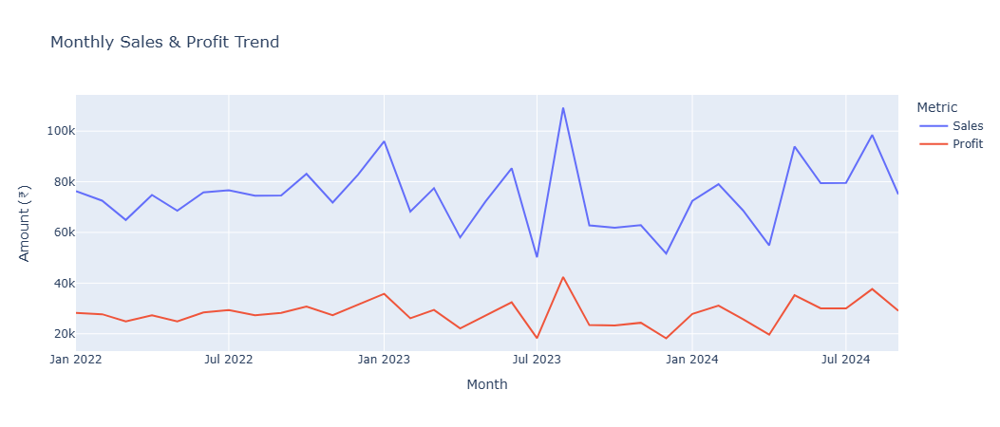

# **KPI Dashboard Development**

A professional KPI dashboard project built in Python using **Pandas, Plotly, Statsmodels**.  
It generates synthetic retail data, computes KPIs, visualizes business performance, and forecasts sales using ARIMA.  

---

## **Features**
- Synthetic **Superstore-like dataset** (Orders, Sales, Profit, Delivery).  
- **Overall KPIs**: Revenue, Orders, Avg Order Value, Profit Margin, Delivery Days, Customers.  
- **Visualizations**:
  - Monthly Sales & Profit Trend  
  - Sales by Region (Bar)  
  - Sales by Category (Donut)  
  - Delivery Days by Region (Box)  
  - Customer Segment Share (Pie)  
  - Sales Forecast (ARIMA)  
- **Exported dataset** for reproducibility.  

---

## **Tech Stack**
- Python (Pandas, NumPy)  
- Plotly (Interactive charts)  
- Statsmodels (ARIMA forecasting)  
- Faker (Synthetic data generation)  
- Google Colab (Notebook execution)  

---

Screenshots
### Screenshots

**Monthly Sales & Profit Trend**  

---

**Sales by Region**  

---

**Sales by Category**  

---

**Delivery Days Distribution**  

---

**Customer Segments**  

---

**Forecast (ARIMA)**  

## **Repository Structure**

KPI-Dashboard/
│
├── **data/** 
│   └── superstore_clean.csv       # Exported cleaned dataset
│
├── **notebooks/**  
│   └── KPI_Dashboard_Colab.ipynb  # Main Colab notebook (project code)
│
├── **screenshots/**                   # Exported charts & visuals
│   ├── monthly_sales_trend.png
│   ├── sales_by_region.png
│   ├── sales_by_category.png
│   ├── delivery_days_region.png
│   ├── sales_by_segment.png
│   └── sales_forecast.png
│
└── **README.md**                      # Project documentation

---

